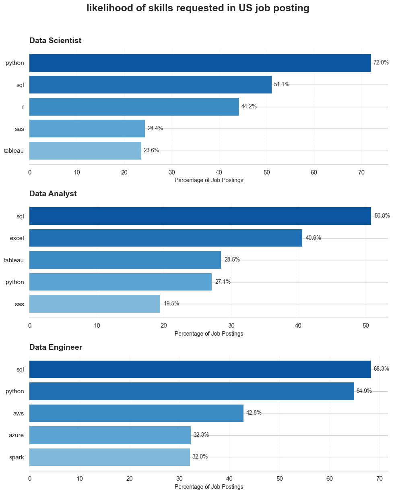
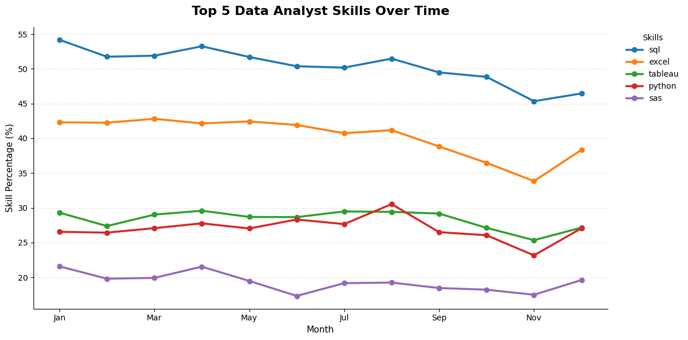
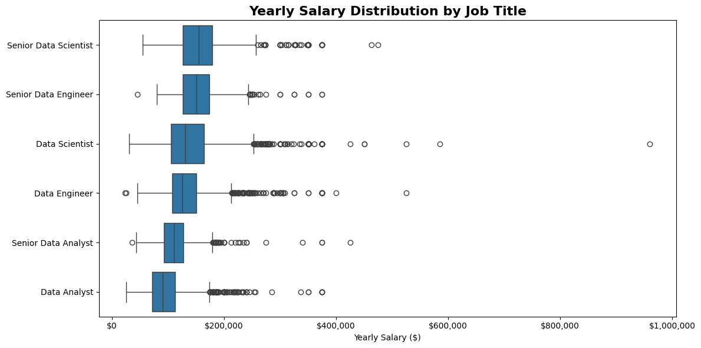
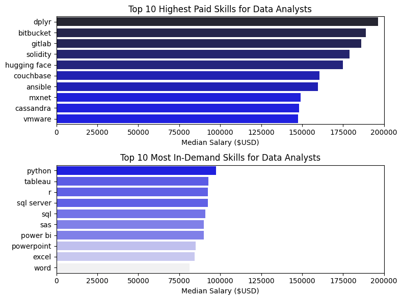

# Overview 
Welcome to my analysis of the data job market, focusing on data analyst roles. This project was created out of a desire to navigate and understand the job market more effectively. It delves into the top-paying and in-demand skills to help find optimal job opportunities for data analysts. 
The data sourced from [Luke Barousse's](Lukebarousse/data_jobs) Python Course which provides a foundation for my analysis, containing detailed information on job titles, salaries, locations, and essential skills. Through a series of Python scripts, I explore key questions such as the most demanded skills, salary trends, and the intersection of demand and salary in data analytics. 
# The Questions 
Below are the questions I want to answer in my project: 
1. What are the skills most in demand for the top 3 most popular data roles? 
2. How are in-demand skills trending for Data Analysts? 
3. How well do jobs and skills pay for Data Analysts? 

# Tools I Used 
For my deep dive into the data analyst job market, I harnessed the power of several key tools:

- Python: The backbone of my analysis, allowing me to analyze the data and find critical insights.l also used the following Python libraries: 

  o Pandas Library: This was used to analyze the data. 

  o Matplotlib Library: I visualized the data. 
   o Seaborn Library: Helped me create more advanced visuals. 
- Jupyter Notebooks: The tool I used to run my Python scripts which let me easily include my notes and analysis. 
- Visual Studio Code: My go-to for executing my Python scripts. 
- Git & GitHub: Essential for version control and sharing my Python code and analysis, ensuring collahoration and project tracking

# Data Preparation and Cleanup 
This section outlines the steps taken to prepare the data for analysis, ensuring accuracy and usability. 
# Import & Clean Up Data 
I start by importing necessary libraries and loading the dataset, followed by initial data cleaning tasks to ensure data quality
``` python
import pandas as pd
from datasets import load_dataset
import matplotlib.pyplot as plt
import numpy as np
import ast
import seaborn as sns

# loading data
dataset = load_dataset('Lukebarousse/data_jobs')
df = dataset['train'].to_pandas()

# data cleaning
df['job_posted_date'] = pd.to_datetime(df['job_posted_date'])
df['job_skills'] = df['job_skills'].apply(lambda x: ast.literal_eval(x) if pd.notna(x) else x)
```


# The Analysis

## What is the most demand skills for the top 3 most popular data roles ?


to find them , i filtered out those 3 positions by which one were the most popular , and got the top 5 skills for these top 3 roles. 

view my notebook with steps:

[2-skills_count.ipynb](4-project\2-skills_count.ipynb)

### Visualize Data
```python
fig, axes = plt.subplots(
    nrows=len(job_titles),
    ncols=1,
    figsize=(10, 4 * len(job_titles)))

if len(job_titles) == 1:
    axes = [axes]
colors = mpl.colormaps["Blues"]

for ax, job_title in zip(axes, job_titles):
        data = (df_skill_prcn[df_skill_prcn["job_title_short"] == job_title].head(5).sort_values("skill_percn"))
    
    bar_colors = colors(
        [0.45 + (i / len(data)) * 0.5 for i in range(len(data))])
    
    bars = ax.barh(
        data["job_skills"],
        data["skill_percn"],
        color=bar_colors,
        edgecolor="none")
    
    ax.set_title(
        job_title,
        fontsize=14,
        fontweight="bold",
        loc="left",
        pad=10)
    
    ax.set_xlabel("Percentage of Job Postings", fontsize=10)
    ax.set_ylabel("")
    
    for bar, value in zip(bars, data["skill_percn"]):
        ax.text(value + 0.5,bar.get_y() + bar.get_height() / 2,f"{value:.1f}%",va="center",fontsize=10,color="#333333")

    
    ax.spines["top"].set_visible(False)
    ax.spines["right"].set_visible(False)
    ax.spines["left"].set_visible(False)

    ax.grid(
        axis="x",
        linestyle="--",
        alpha=0.25)

    ax.set_axisbelow(True)


fig.suptitle(
    "likelihood of skills requested in US job posting",
    fontsize=18,
    fontweight="bold",
    y=1.02)

plt.tight_layout()
plt.show()

```
### Resluts


### Insights
- SQL is the universal skill — it appears in the top 3 for all three roles (51%, 68%, 51%), making it the safest first skill to learn regardless of which data career path you choose.
- Python dominates the more technical roles — it's the #1 skill for Data Scientists (72%) and #2 for Data Engineers (65%), but ranks lower for Data Analysts (27%), showing a clear skills gradient from analysis → engineering/science.
- Cloud platforms are Engineer-specific — AWS (43%) and Azure (32%) only show up prominently in Data Engineer postings, reflecting the infrastructure focus of that role versus the analytical focus of the other two.
- Visualization tools (Tableau, Excel) cluster around Data Analyst — reinforcing that this role leans more toward reporting/BI than programming.

# The Analysis

## 2- How are in-demand skills trending for Data Analyst
---
### visulize Data

```python
import matplotlib.pyplot as plt

# Select the first 5 skills
df_plot = df_DA_percnt.iloc[:, :5]

# Create the chart
ax = df_plot.plot(
    kind="line",
    figsize=(12, 6),
    linewidth=2.5,
    marker="o"
)

# Titles and labels
ax.set_title(
    "Top 5 Data Analyst Skills Over Time",
    fontsize=16,
    fontweight="bold",
    pad=15
)

ax.set_xlabel("Month", fontsize=11)
ax.set_ylabel("Skill Percentage (%)", fontsize=11)

# Make it cleaner
ax.spines["top"].set_visible(False)
ax.spines["right"].set_visible(False)

ax.grid(
    axis="y",
    linestyle="--",
    alpha=0.3
)

# Put legend outside the chart
ax.legend(
    title="Skills",
    bbox_to_anchor=(1.02, 1),
    loc="upper left",
    frameon=False
)

plt.tight_layout()
plt.show()
```

### Results 


*bar graph visulizing the trinding top skills for data analyst in the US*

- SQL remains the most in-demand skill throughout the entire period, consistently appearing in roughly 45–54% of job postings. Although it declined toward November, it remained clearly ahead of the other skills.
- Excel is the second most demanded skill, starting at around 42% and generally declining over the year. The sharpest drop occurs around October–November, reaching approximately 34%, before recovering in December.
- Tableau and Python show similar levels of demand, generally ranging between 25–30%. Notably, Python briefly overtakes Tableau around August, suggesting a temporary increase in Python's relative demand.
- Python shows the most noticeable volatility among the lower-ranked skills. It peaks at approximately 30.5% in August, then drops significantly to around 23% in November, before recovering in December.

---
## 3-How will do jobs and skills pay for Data Analyst?
---
### salary analysis
### Visulaize Data
```python
from matplotlib.ticker import StrMethodFormatter
order = (df_USA_top6.groupby('job_title_short')['salary_year_avg'].median().sort_values(ascending=False).index)
plt.figure(figsize=(12, 6))
sns.boxplot(data=df_USA_top6,x='salary_year_avg',y='job_title_short',order=order)

plt.title('Yearly Salary Distribution by Job Title',fontsize=16, fontweight='bold')
plt.xlabel('Yearly Salary ($)')
plt.ylabel('')

plt.gca().xaxis.set_major_formatter(StrMethodFormatter('${x:,.0f}'))
plt.tight_layout()
plt.show()
```

#### results


#### insights
- Role Hierarchy: Senior Data Scientists and Senior Data Engineers command the highest median salaries (~$180k–$200k+), followed closely by mid-level Data Scientists/Engineers, while Data Analysts have the lowest median pay across all tiers.
​- Core Pay Consistency: The middle 50% (blue boxes) for each role is relatively tight, showing standardized base pay bands across standard corporate levels.
​- Salary Progression: Moving from mid-level to senior roles provides a clear, noticeable bump in both median pay and overall earnings ceiling for every role type.
- ​Extreme Upper Outliers: Every job title exhibits strong positive skewness with high outliers ($200k–$600k+), heavily driven by total compensation, stock options, or high-tier tech markets.
- ​Max Outlier: Data Scientist features the highest extreme outlier on the chart, reaching near $1,000,000.
​- Lower Anomalies: Rare bottom outliers exist below $50k (likely representing international roles, contractors, or data entry artifacts).
---
# 3-How well do jobs and skills pay for Data

## Highest paid & most demanded skills for Data analysis
### Visulize Data
```python
fig, ax = plt.subplots(2, 1, figsize=(8, 6))

# Top Paying Skills
df_DA_top_pay = df_DA_top_pay.head(10)
sns.barplot(data=df_DA_top_pay, x='median', y=df_DA_top_pay.index, ax=ax[0], hue='median', palette='dark:b_r', legend=False)
ax[0].set_title('Top 10 Highest Paid Skills for Data Analysts')
ax[0].set_ylabel('')
ax[0].set_xlabel('Median Salary ($USD)')
ax[0].legend().set_visible(False)
ax[0].set_xlim(0, 200000)

# Top Demanded Skills
df_DA_top_skills = df_DA_top_skills.head(10)
sns.barplot(data=df_DA_top_skills, x='median', y=df_DA_top_skills.index, ax=ax[1], hue='median', palette='light:b', legend=False)
ax[1].set_title('Top 10 Most In-Demand Skills for Data Analysts')
ax[1].set_ylabel('')
ax[1].set_xlabel('Median Salary ($USD)')
ax[1].set_xlim(0, 200000)

fig.tight_layout()
plt.show() 
```
#### Results 


#### insights:

- There's a clear disconnect between what pays the most and what's actually in demand. - - - - - Specialized, niche tools — dplyr, Bitbucket, GitLab, Solidity, Hugging Face — command the highest median salaries (up to ~$200K), but they appear in relatively few job postings, suggesting they're valued as rare, high-impact skills rather than baseline requirements.
- In contrast, the most in-demand skills — Python, Tableau, R, SQL, Excel — pay solidly (mostly $80K–$100K) but don't top the salary charts. These are the "table stakes" of the field: expected by nearly every employer, which keeps competition (and salaries) more moderate.


# Conclusion 
This exploration into the data analyst job market has been incredibly informative, highlighting the critical skills and trends that shape this evolving field. The insights I got enhance my understanding and provide actionable guidance for anyone looking to advance their career in data analytics. As the market continues to change, ongoing analysis will be essential to stay ahead in data analytics. This project is a good foundation for future explorations and underscores the importance of continuous learning and adaptation in the data field